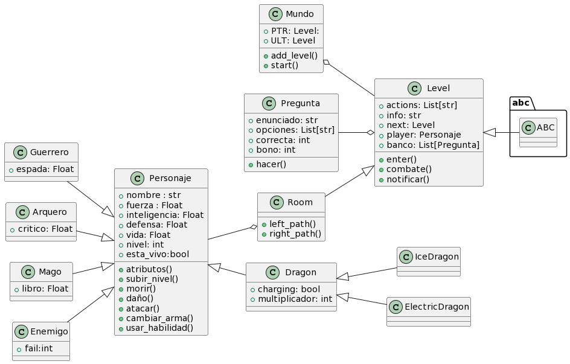

# Nombre del juego

## **Descripción**
(game_name) Es una aventura de texto interactiva con elementos de una novela visual que permite repasar temas de la Programación Orientada a Objetos.

El usuario juega como un Personaje creado para derrotar al Gran Tirano que ha tomado control de las tierras. Por medio de combates, decisiones, preguntas y exploración busca aumentar sus atributos y llegar a crear un poderoso Dragón y devolver la paz a la región.

El juego base contiene 3 niveles con múltiples ramificaciones, la narrativa completa se puede obtener en repetidos juegos.

###  *Clases de Personajes* 
### **Guerrero** :crossed_swords:
Su defensa y fuerza prioriza combates, pero su limitada inteligencia requiere de aumentos.
* Fuerza: 25
* Inteligencia: 5
* Defensa: 20/25
* Vida: 100
* Espada: 9/11
* **Habilidad especial:** Reducir la fuerza del enemigo

### **Mago** :mage_man:
Aunque su vida sea baja, posee una inteligencia base alta que permite descubrir más secretos.
* Fuerza: 10 
* Inteligencia: 20
* Defensa: 15
* Vida: 80/85
* Libro: 15/10
* **Habilidad especial:** Reducir la defensa del enemigo

### **Arquero** :bow_and_arrow:
Posee atributos promedio compensados con la probabilidad de daño crítico en sus ataques básicos y un secreto especial para este tipo de Personaje.
* Fuerza: 15
* Inteligencia: 10
* Defensa: 15
* Vida: 95/90
* Crítico: 9/13
* **Habilidad especial:** realizar daño ignorando armadura y aumentar probabilidad de fallar

## Diagrama UML de Clases

## Guía de Instalación
1. Ingrese al link del repositorio 

2. Seleccione Code (Botón verde) y copie el enlace HTTPS 

3. Ingrese a un IDE como Visual Studio Code 

4. Por terminal o alguna otra herramienta clone el repositorio con el enlace 

6. Ingrese al script code_to_run.py y ejecute el código por terminal 

# Créditos Sonido :notes:
+ *Motoi, Sakuraba.(2016).Nameless King on Album Dark Souls 3 OST*
+ *Kitamura, Yuka.(2016).Dark Souls 3 Main Theme on Album Dark Souls 3 OST*