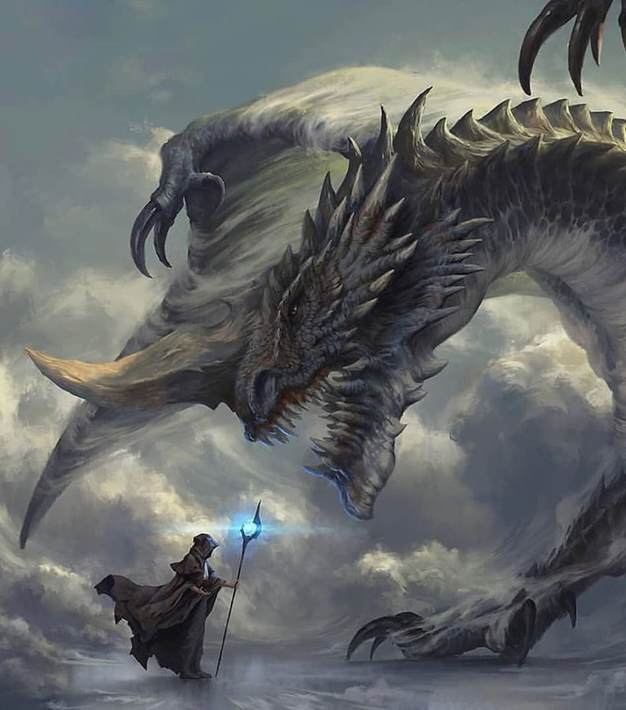

# OOP_FinalProject

## **Tipos de Personaje**
### Guerrero 
* Fuerza: 25
* Inteligencia: 5
* Defensa: 20/25
* Vida: 100
* Espada: 9/11

### Mago
* Fuerza: 10 
* Inteligencia: 20
* Defensa: 15
* Vida: 80/85
* Libro: 15/10

### Arquero
* Fuerza: 15
* Inteligencia: 10
* Defensa: 15
* Vida: 95/90
* Crítico: 13
